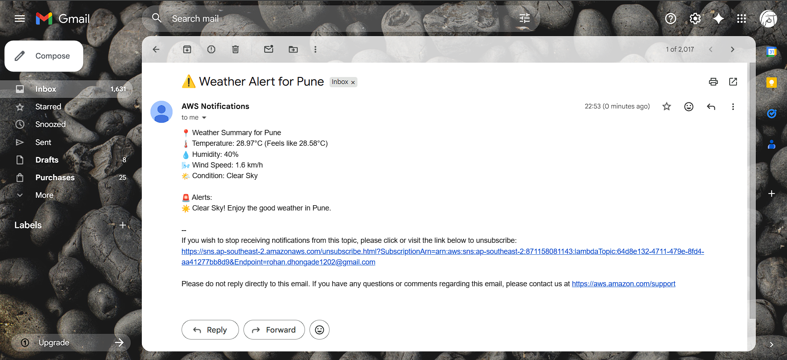

# serverless-weather-alert-system
Serverless weather alert system built with AWS Lambda, SNS, and OpenWeather API to send real-time notifications based on weather conditions.

---

## 🚀 Features

- 🌍 Fetches real-time weather data using OpenWeather API  
- ⚡ Runs on AWS Lambda (no servers needed)  
- 📩 Sends notifications via AWS SNS (Email alerts)  
- 🚨 Detects extreme weather conditions automatically  
- ⏰ Can be scheduled using EventBridge (cron jobs)  

---

## 🛠️ Tech Stack

- AWS Lambda  
- AWS SNS  
- AWS EventBridge  
- Python  
- OpenWeather API  

---

## 🔄 Lambda Function Workflow

1. 🌐 Fetch weather data using OpenWeatherMap API  
2. 📊 Extract key metrics:
   - Temperature  
   - Humidity  
   - Wind Speed  
   - Weather Conditions  

3. 🧠 Analyze the data to detect:
   - 🔥 Extreme heat  
   - ❄️ Cold weather  
   - 🌪️ Strong winds  
   - 🌧️ Rain / Storm / Fog  

4. 📝 Generate a detailed weather report  

5. 📩 Send alerts and summary via AWS SNS to notify users

---

## 🔐 Environment Variables

⚠️ Don't forget to set these environment variables in your AWS Lambda configuration:

| Variable Name            | Description                                  | Example              |
|--------------------------|----------------------------------------------|----------------------|
| OPENWEATHER_API_KEY      | Your API key from OpenWeatherMap             | YOUR_WEATHER_API     |
| SNS_TOPIC_ARN            | The ARN of your SNS topic                    | YOUR_SNS_ARN         |

---

## ⚙️ Setup Guide 

### 1️⃣ Create Lambda Function

1. Go to AWS Console  
2. Search → **Lambda**  
3. Click **Create function**  
4. Choose:
   - **Author from scratch**
5. Fill details:
   - **Function name:** `weather-alert-bot`
   - **Runtime:** Python 3.10  
6. Click **Create**

---

### 2️⃣ Add Your Code

1. Go to the **Code** tab  
2. Replace the default code with given python script  
3. Click **Deploy**

---

### 3️⃣ Configure Environment Variables

Go to:  
**Configuration → Environment variables → Edit**

Add the following:

| Key                      | Value            |
|--------------------------|------------------|
| OPENWEATHER_API_KEY      | your_api_key     |
| SNS_TOPIC_ARN            | your_sns_arn     |

---

### 4️⃣ Set Permissions (Important)

Your Lambda function needs permission to publish messages to SNS.

1. Go to:  
   **Configuration → Permissions → Execution role**
2. Click the role name  
3. Attach policy:
   - `AmazonSNSFullAccess`  

> 🔒 Recommended: Create a custom policy with only `sns:Publish` permission for better security.

---

### 5️⃣ Create SNS Topic

1. Go to **SNS (Simple Notification Service)**  
2. Click **Create topic**  
3. Choose:
   - Type → **Standard**
4. Set name:
   - `weather-alert-topic`
5. Click **Create**

---

### 6️⃣ Create Subscription

1. Open your SNS topic  
2. Click **Create subscription**  
3. Select:
   - Protocol → **Email**
4. Enter your email address  
5. Click **Create subscription**

📧 Check your inbox and **confirm the subscription**

---

✅ Your system is now ready to send weather alerts!

---

## ⏰ Setup EventBridge (Daily Trigger at 8 AM)

To automate the Lambda function, use Amazon EventBridge to trigger it daily.

### Steps:

1. Go to **AWS Console**
2. Search → **EventBridge**
3. Click **Create rule**

4. Fill details:
   - **Name:** `weather-alert-schedule`
   - **Rule type:** Schedule

5. Choose schedule pattern:
   - Select **Cron expression**
   - Use:

```bash
cron(0 8 * * ? *)
```
⏰ This runs the Lambda every day at 8:00 AM (UTC)
Adjust time based on your timezone if needed.

6. Add Target
  - Select Target type: AWS service
  - Choose Lambda function
  - Select your function: weather-alert-bot
  - Click Create

---

## 🧪 Testing the Lambda Function
Manual Test 
  - Go to AWS Lambda
     Open your function
  - Click Test
  - Create a test event:
  - Name: test-weather
  - Event JSON:
```JSON
{}
```
- Click Test

---

## ✅ Expected Result
- Status Code: 200
- No errors in logs
- 📧 Email notification received via SNS

---



